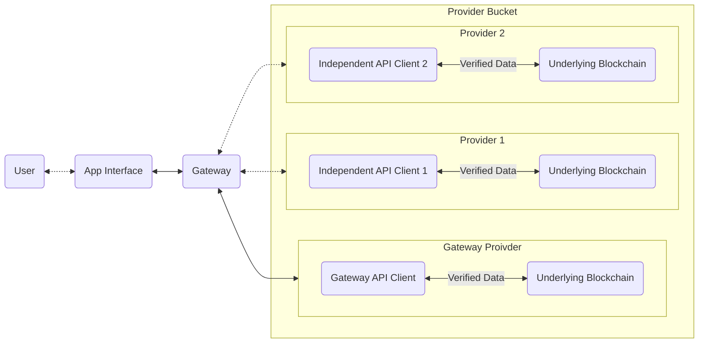
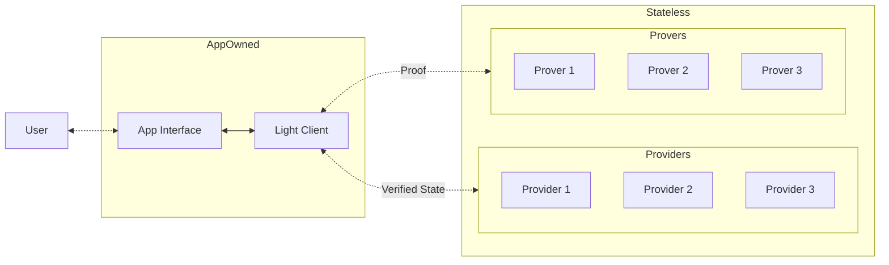

# Introduction

Stateless is an arbitration protocol that provides trustless verification standards for decentralized networks. By developing robust verification models and distributing them through open-source software (OSS) and service providers, we enhance security for application developers and their users. Stateless ensures secure, reliable data interactions through real-time dispute resolution and data integrity verification, addressing critical vulnerabilities in decentralized applications with minimal changes to existing codebases.

# Problem Statement

The design patterns encouraged by the current Ethereum Execution API and other
decentralized APIs which have taken inspiration from Ethereum have attack vectors
that exist in situations of compromised operational trust between an
application interface acting as a data consumer and an independent data
provider. Should that operational trust be compromised, these attacks **cannot
currently be mitigated** in real-time and **cannot be detected historically**
in an audit of event logs.  Proposed solutions such as light clients provide
long-term, cryptographic approaches to address these issues. However, they are
not near-term applicable, leaving applications and users currently exposed to
risks.

## Risks to Applications and Consumers

The risks that certain applications and their consumers face if provider trust is compromised,
includes:

- **Indirect Theft of Funds** through maliciously created MEV arbitrage
  opportunities
- **Direct Theft of Funds** for a significant majority of existing DeFi
  applications.
- **Exposure to XSS and Malware Distribution** for applications resolving media
  and code either stored or linked to on chain.

There is current exposure to such attacks in all of the major pillars of
the web3 ecosystem including, but not limited to:

- DeFi
- Decentralized Namespaces
- NFTs
- Reusable Account Abstraction Entrypoints (ERC-4337)

## Limitations of Current Infrastructure Providers

Existing solutions in the market have some notable limitations, including
security, fault tolerance, and high barriers to decentralizing. Centralized
infrastructure providers such as Infura and Alchemy have a single point of
failure, potentially compromising the security and reliability of applications.

Decentralized providers such as Pocket Network and Lava have even lower barriers to
entry, requiring a nominal financial investment to begin serving data to
production applications. These network protocols lack any direct protection for
application developers, and can inadvertently reward bad actors who serve
fraudulent and malicious data.

# Solution: Stateless Verification Standards

Stateless addresses the security needs of blockchain application developers and their users by providing a robust verification standard. This standard makes decentralized data deterministic, auditable, and verifiable. Our framework involves implementing changes at the client, execution, and compiler levels, which are open-sourced through Stateless SDKs. These changes can be enshrined into core protocols, or our clients can be utilized to bring these capabilities to any existing platform or service. From the consumer or developer perspective, workflows remain unchanged as our clients are backward compatible ensuring a seamless transition to enhanced security.

When protocols and providers adopt our verification standard, they automatically make the requests on those platforms auditable and provide the necessary tools to aggregate multiple providers. This significantly enhances security, requiring a malicious actor to compromise multiple independent providers simultaneously rather than just one.

## Disputes and Arbitration  

While Stateless does not provide services directly through our network, we offer client standards and frameworks that others use to deliver verifiable and trustless data through their services. The primary role of the Stateless protocol is to act as an arbitrator in the event of disputes related to data integrity or trust failures. Instead of bundling risk into the entire service, we acknowledge its presence and focus on adding value at the point of consumption. Stateless opts for an optimistic solution where risks can be pooled, providers can be punished, and users can be compensated for any losses.

### Tokenomics and Protocol Actors

The Stateless Protocol utilizes the SSL token to underpin its economic model, ensuring secure and reliable interactions within its ecosystem. The tokenomics strategy aims to balance long-term protocol health with the needs of users, providers, and other participants. Below is an overview of the key design decisions, token dynamics, and initial use cases.

**Pool Managers:**
Pool Managers (“Managers”) develop pool strategies and manage those strategies. For their role, Managers earn a percentage of the fees created by the pool, dictated by the Pool Manager. A reader may liken these to providers on EigenLayer where restakers are relying on the provider to provide security/services to AVSs but are punished if the provider fails to provide good services. 

**Data Providers:**
Compute Providers (“Providers”) run the Stateless client, stake SSL, and provide data to Data Consumers. Responsible for responding to challenge transactions, and validating or invalidating challenges involving third-party providers.

**Data Consumers:**
Data Consumers (“Consumers”) consume data and pay into risk pools. 

A note: We envision that it may take some time for Stateless to provide frictionless payment mechanisms. We imagine that other parties may pay into the pools in place of the actual data consumer. This approach has its own merits.

**Stakers/Restakers:**
Stakers/Restakers (“Stakers”) provide stakes (capital) that protect Consumers and receive payments from Consumers (or other interested parties) in exchange for their risk. Stakers provide governance oversight (by staking SSL) to Managers and arbitration proceedings.

**Stakeholders:**
SSL Stakers (“Stakeholders”) acquire and stake SSL on behalf of Managers in one or more pools in exchange for a portion of the management fees of the pools. As management fees increase, so does the real yield for SSL stakeholders. Stakeholders, like Stakers, are keen to profit from participation in the protocol, but might not be willing to accept the risk of participating in a pool. To generate interest and attraction from these individuals, we designed a staking-style mechanism where investors can stake to be eligible for protocol fees in proportion to the amount the investor staked. 

## Proof of Concept: Verifiable RPC
The first iteration of Stateless focused on building a
frictionless experience for application developers to secure their
existing applications.

Application developers have access to both a CLI and HTTPS API for
managing "buckets" of independent providers. The application will be able to
select as many providers as they wish to attempt to source data from, as well
as the number of attestations they require to accept that data, similar to the
experience of setting up a multisig Safe wallet. Developers will have full
control of any performance trade-offs that would be made from now sourcing data
from multiple providers, and will have a clear picture of the impacts of their
choices. Developers will be able to modify and view their existing buckets
either interactively through the CLI, or programmatically in their existing
CI/CD pipelines.

Once their bucket has been setup, developers will can create an invoice
contract to manage the billing of any buckets that they've created. Once that
invoice contract has been deployed, anyone is able to send a custom restricted
ERC-20 token functioning as Compute Credits to that invoice contract. The
Compute Credit ERC-20 will not be a liquid speculative token. This token will
only be exchangeable for whitelisted stablecoins, and can only be sent to
existing invoices or returned back for stablecoins. Once the credits have
been sent to the invoice, any usage will be drawn out of that invoice by
an account owned by Stateless based on observed network usage. The invoice
owner will be free to stop billing and withdraw any remaining credits at
any point in time.

Finally, the experience of integrating the provider bucket can be as simple as
replacing the existing RPC URL in the interface if the developer chooses, or
to eliminate any integrity trust, simply wrapping their existing provider
with a lightweight wrapper, minimizing any code changes in their existing
codebase to as little as possible.

# Roadmap and Future Developments

**2024 Testnet:** Stateless is focusing on leveraging its foundational infrastructure to build and enhance the architecture for a proof based consumer light client framework. The protocol will also diversify to support AI (non-blockchain) applications, ensuring our verification standards are applicable across a broader range of data sources. The first limited testnet of the arbitration protocol and systems for API key management and provider aggregation will launch in Q4. 

**2025 Mainnet:** The Stateless protocol will establish additional risk pools, develop risk aggregators, and further align fee mechanisms with streaming payments. Additionally, we will release service provider SDKs and enhance our open-source software (OSS) offerings, including clients and explorers. With these elements in place, we will launch our mainnet and transition to a fully tokenized economy. 

# Conclusion

As web3 continues to expand, the risks outlined in this paper become increasingly critical. Stateless provides the essential infrastructure to facilitate a risk-minimized, verifiable, and trustless transition for this new data economy. By ensuring robust security and data integrity through our verification standards, we enable a seamless and secure experience for both developers and consumers.
