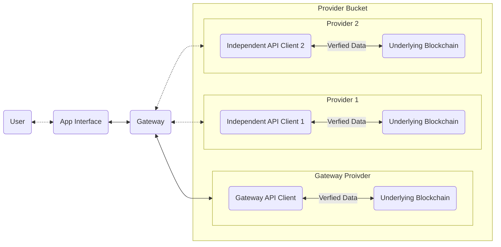
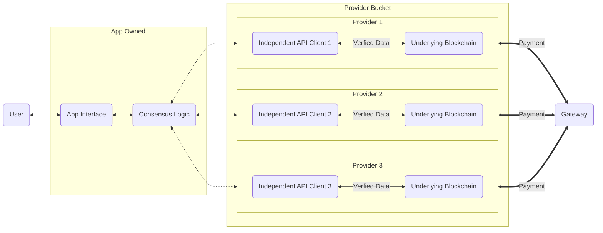

# Introduction

Stateless is a startup focused on addressing the middleware needs of blockchain
networks. This initiative was born out of the recognition that various attack
vectors exist within the design patterns of existing blockchain applications,
with significant exposure in the Ethereum ecosystem. Stateless aims to mitigate
these risks by providing a robust middleware solution, allowing application
developers to provider their users with enhanced security when interacting
with blockchain networks.

# Problem Statement

The design patterns encouraged by the current Ethereum Execution API and other
blockchain APIs which have taken inspiration from Ethereum have attack vectors
that exist in situations of compromised operational trust between an
application interface acting as an RPC consumer and an independent RPC
provider. Should that operational trust be compromised, these attacks **cannot
currently be mitigated** in real-time and **cannot be detected historically**
in an audit of event logs.  Proposed solutions such as light clients provide
long-term, cryptographic approaches to address these issues. However, they are
not near-term applicable, leaving applications and users currently exposed to
risks.

## Risks to Applications

The risks that certain applications face if provider trust is compromised,
includes:

- **Indirect Theft of Funds** through maliciously created MEV arbitrage
  opportunities
- **Direct Theft of Funds** for a significant majority of existing DeFi
  applications.
- **Exposure to XSS and Malware Distribution** for applications resolving media
  and code either stored or linked to on chain.

There is current exposure to such attacks in all of the major pillars of
the web3 ecosystem including, but not limited to:

- DeFi
- Decentralized Namespaces
- NFTs
- Reusable Account Abstraction Entrypoints (ERC-4337)

## Limitations of Current Infrastructure Providers

Existing solutions in the market have some notable limitations, including
security, fault tolerance, and decentralization concerns. Centralized
infrastructure providers such as Infura and Alchemy have a single point of
failure, potentially compromising the security and reliability of applications.

Decentralized providers such as Pocket and Lava have even lower barriers to
entry, requiring a nominal financial investment to begin serving data to
production applications. These network protocols lack any direct protection for
application developers, and will even inadvertently reward bad actors who serve
fraudulent and malicious data.

# Stateless Middleware: A Solution

Stateless is designed to address the security needs of blockchain application
developers and their users by providing a middleware solution that enhances
security without the need for developers to make any changes to their existing
codebase. Stateless middleware allows applications to utilize multiple
independent provider sources, requiring a malicious actor to compromise
multiple independent providers simultaneously, as opposed to the current
landscape which only requires one.

## Enhanced Security for All

Stateless middleware enables applications to add a mitigation layer simply by
wrapping their API provider layer, minimizing any changes to just at most a few
lines of code. Given the open development nature of blockchain applications,
and the prevalence of forks across the ecosystem, it was essential to allow any
developer to easily protect their users, regardless if they sufficiently
understood the original code to adapt it in response to the public disclosure
of the existing attack vectors.

While the issues identified have the most pronounced impact in the Ethereum
ecosystem, Stateless middleware is designed to be adaptable to various
blockchain networks, ensuring that the provided security enhancements can be
applied to a wider range of blockchain based application development.

## Stateless From the Perspective of an Application Developer

The first iteration of Stateless will be focused on building a
frictionless experience for application developers to secure their
existing applications.

Application developers will have access to both a CLI and HTTPS API for
managing "buckets" of independent providers. The application will be able to
select as many providers as they wish to attempt to source data from, as well
as the number of attestations they require to accept that data, similar to the
experience of setting up a multisig Safe wallet. Developers will have full
control of any performance trade-offs that would be made from now sourcing data
from multiple providers, and will have a clear picture of the impacts of their
choices. Developers will be able to modify and view their existing buckets
either interactively through the CLI, or programmatically in their existing
CI/CD pipelines.

Once their bucket has been setup, developers will be able to create an invoice
contract to manage the billing of any buckets that they've created. Once that
invoice contract has been deployed, anyone is able to send a custom restricted
ERC-20 token functioning as Compute Credits to that invoice contract. The
Compute Credit ERC-20 will not be a liquid speculative token. This token will
only be exchangeable for whitelisted stablecoins, and can only be sent to
existing invoices or returned back for stablecoins. Once the credits have
been sent to the invoice, any usage will be drawn out of that invoice by
an account owned by Stateless based on observed network usage. The invoice
owner will be free to stop billing and withdraw any remaining credits at
any point in time.

Finally, the experience of integrating the provider bucket can be as simple as
replacing the existing RPC URL in the interface if the developer chooses, or
to eliminate any integrity trust, simply wrapping their existing provider
with a lightweight wrapper. Minimizing any code changes in their existing
codebase to as little as possible.

# Roadmap and Future Developments

Stateless has a clear roadmap for its development, focusing on both short-term
and long-term goals that aim to revolutionize the blockchain infrastructure
space, while remaining in lock step with the evolutions current and future
blockchain networks.

**2023**: Launch permissioned decentralized middleware. This milestone focuses
on developing and deploying a secure and fault-tolerant middleware solution
that addresses the limitations of current offerings. By introducing a
permissioned decentralized middleware, Stateless will set the stage for more
advanced features and improvements in the coming years.

**2024**: Introduce a developer UI and shift consensus ownership to the
application layer by integrating directly with existing standard libraries.
Stateless will enhance developer experience by providing a user-friendly
interface that simplifies the process of building and deploying applications on
the platform.  By shifting consensus ownership to the application layer,
Stateless will promote greater decentralization and empower developers with
more control over their applications.

**2025**: Generate additional revenue streams from value-added services. As the
Stateless platform matures, the focus will shift towards expanding the
ecosystem and offering a broader range of services. This will include building
in hooks so application developers can charge fees for user incurred
infrastructure costs, expanding into other blockchain ecosystems, offering
decentralized APIs in untapped markets, and improving the performance of the
ETH execution layer.

**2027-2030**: Establish a decentralized prover market that facilitates direct
services between apps and nodes. In the long term, Stateless aims to create a
robust and competitive market for decentralized provers. This will enable
applications to interact directly with nodes, further decentralizing the
ecosystem and enhancing the security and efficiency of the platform. By
establishing a decentralized prover market, Stateless will solidify its
position as a leading middleware solution in the blockchain industry.

These milestones will guide Stateless's growth and innovation, ensuring that
the platform remains at the forefront of the blockchain middleware space. With
a strong emphasis on security, decentralization, and developer experience,
Stateless is poised to reshape the landscape for blockchain applications and
services.

# Conclusion

Stateless is committed to providing a robust middleware solution to enhance
security in blockchain networks, addressing the risks associated with
compromised operational trust. By offering a middleware solution that adapts to
future advancements in blockchain technology and applies to various networks,
Stateless aims to become an integral player in the evolving blockchain
ecosystem.

