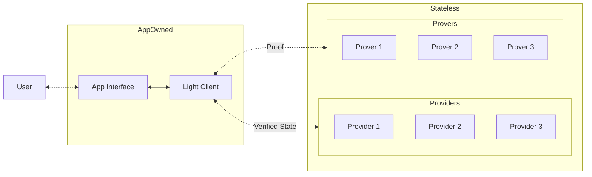

# Introduction

Stateless is a startup focused on addressing the middleware needs of blockchain
networks. This initiative was born out of the recognition that various attack
vectors exist within the design patterns of existing blockchain applications,
with significant exposure in the Ethereum ecosystem. Stateless aims to mitigate
these risks by providing a robust middleware solution, allowing application
developers to provider their users with enhanced security when interacting
with blockchain networks.

# Problem Statement

The design patterns encouraged by the current Ethereum Execution API and other
blockchain APIs which have taken inspiration from Ethereum have attack vectors
that exist in situations of compromised operational trust between an
application interface acting as an RPC consumer and an independent RPC
provider. Should that operational trust be compromised, these attacks **cannot
currently be mitigated** in real-time and **cannot be detected historically**
in an audit of event logs.  Proposed solutions such as light clients provide
long-term, cryptographic approaches to address these issues. However, they are
not near-term applicable, leaving applications and users currently exposed to
risks.

## Risks to Applications

The risks that certain applications face if provider trust is compromised,
includes:

- **Indirect Theft of Funds** through maliciously created MEV arbitrage
  opportunities
- **Direct Theft of Funds** for a significant majority of existing DeFi
  applications.
- **Exposure to XSS and Malware Distribution** for applications resolving media
  and code either stored or linked to on chain.

There is current exposure to such attacks in all of the major pillars of
the web3 ecosystem including, but not limited to:

- DeFi
- Decentralized Namespaces
- NFTs
- Reusable Account Abstraction Entrypoints (ERC-4337)

## Limitations of Current Infrastructure Providers

Existing solutions in the market have some notable limitations, including
security, fault tolerance, and decentralization concerns. Centralized
infrastructure providers such as Infura and Alchemy have a single point of
failure, potentially compromising the security and reliability of applications.

Decentralized providers such as Pocket Network and Lava have even lower barriers to
entry, requiring a nominal financial investment to begin serving data to
production applications. These network protocols lack any direct protection for
application developers, and can inadvertently reward bad actors who serve
fraudulent and malicious data.

# Stateless Middleware: A Solution

Stateless is designed to address the security needs of blockchain application
developers and their users by providing a middleware solution that enhances
security without the need for developers to make any changes to their existing
codebase. Stateless middleware allows applications to utilize multiple
independent provider sources, requiring a malicious actor to compromise
multiple independent providers simultaneously, as opposed to the current
landscape which only requires one.

## Enhanced Security for All

Stateless middleware enables applications to add a mitigation layer simply by
wrapping their API provider layer, minimizing any changes to just at most a few
lines of code. Given the open development nature of blockchain applications,
and the prevalence of forks across the ecosystem, it was essential to allow any
developer to easily protect their users, regardless if they sufficiently
understood the original code to adapt it in response to the public disclosure
of the existing attack vectors.

While the issues identified have the most pronounced impact in the Ethereum
ecosystem, Stateless middleware is designed to be adaptable to various
blockchain and decentralized networks, ensuring that the provided security enhancements can be
applied to a wider range of decentralized application development.

## Stateless From the Perspective of an Application Developer

The first iteration of Stateless will be focused on building a
frictionless experience for application developers to secure their
existing applications.

Application developers will have access to both a CLI and HTTPS API for
managing "buckets" of independent providers. The application will be able to
select as many providers as they wish to attempt to source data from, as well
as the number of attestations they require to accept that data, similar to the
experience of setting up a multisig Safe wallet. Developers will have full
control of any performance trade-offs that would be made from now sourcing data
from multiple providers, and will have a clear picture of the impacts of their
choices. Developers will be able to modify and view their existing buckets
either interactively through the CLI, or programmatically in their existing
CI/CD pipelines.

Once their bucket has been setup, developers will be able to create an invoice
contract to manage the billing of any buckets that they've created. Once that
invoice contract has been deployed, anyone is able to send a custom restricted
ERC-20 token functioning as Compute Credits to that invoice contract. The
Compute Credit ERC-20 will not be a liquid speculative token. This token will
only be exchangeable for whitelisted stablecoins, and can only be sent to
existing invoices or returned back for stablecoins. Once the credits have
been sent to the invoice, any usage will be drawn out of that invoice by
an account owned by Stateless based on observed network usage. The invoice
owner will be free to stop billing and withdraw any remaining credits at
any point in time.

Finally, the experience of integrating the provider bucket can be as simple as
replacing the existing RPC URL in the interface if the developer chooses, or
to eliminate any integrity trust, simply wrapping their existing provider
with a lightweight wrapper. Minimizing any code changes in their existing
codebase to as little as possible.

# Roadmap and Future Developments

Stateless has a clear roadmap for its development, focusing on both short-term
and long-term goals that aim to introduce critical decentralized infrastructure
while remaining in step with the evolutions of current and upcoming data
networks.

Stateless aims to redefine the middleware landscape space by offering a secure and auditable API middleware solution that mitigates vulnerabilities between consumer requests and data node responses. The goal is to protect end consumers from data integrity failures and financial exploitation, ensuring a secure and efficient interface for both user access points and providers.

**2023**: Launch permissioned decentralized middleware. This milestone focuses
on developing and deploying a secure and fault-tolerant middleware solution
that addresses the limitations of current offerings and provides applications with client side request verification.

**2024-2025**: Enhancing the autonomy of our users by expanding the range of tools available to data consumers, with a focus on integrating Infrastructure as Code (IaC) workflows, comprehensive integrated environments, and extensive tracing capabilities. These enhancements aim to increase application resilience and reduce dependency on the Stateless gateway, thereby mitigating potential points of failure and ensuring continuity of service.

Leveraging our legacy verification services, Stateless will begin introducing
proof services, a consumable light client, and extend safety guarantees to
encompass indexing and streaming analytics, enhanced by value-add APIs, and
support for non-blockchain computations such as peer-to-peer or LLM networks.

Stateless's ZK initiatives aim to solidify the infrastructure that underpins
both Layer 1 and Layer 2 solutions (L2s) by providing verifiable state for
consumer light clients and proving the sequence of transactions before they are
submitted to the base Layer 1 (L1) chain. This vital service aims to
revolutionize the credibility and efficiency of the interactions between
applications and various blockchain networks.

Through a federated but heterogeneous node network, Stateless encourages data
providers to continually refine and enhance their services and provers,
fostering a cooperative environment with a diverse range of complementary offerings.This
strategic development positions Stateless as a comprehensive "one-stop"
infrastructure solution where consumers can not only access verifiable RPC but
also choose from a variety of proof-based services tailored to their specific
use cases.

**2026**: Establish a decentralized prover market that catalyzes direct peer-to-peer connections between consumers and nodes, significantly enhancing the integrity and efficiency across decentralized ecosystems. This market will facilitate direct peer-to-peer connections, fostering a permisionless ecosystem for data consumers. The key to this ecosystem is the verifiable compute that underlies every service, ensuring that each transaction and interaction within the Stateless infrastructure is trustworthy and transparent. This initiative, grounded in a blockchain-agnostic ZK infrastructure, enables Stateless to substantiate any transaction on any network supported by the protocol.

This evolution is redefines how decentralized infrastructure is accessed,
offering secure, direct, and cost-effective transactions that align with the
varied demands of various communities, seeking to eliminate the vulnerabilities
associated with intermediary gateways, thus significantly bolstering market
efficiency, security, and reliability.

# Conclusion

As decentralized ecosystems advance, the imperative for secure, reliable, and
efficient middleware solutions become non-negotiable. Stateless has emerged in
response to this need, targeting substantial vulnerabilities in existing
execution layers, bringing an immediately consumable middleware solution that
mitigates potential attack vectors and compromised operational trust associated
with consumer access to market.

Looking ahead, Stateless is building for a future where decentralized data
consumers are liberated from existing vulnerabilities and dependencies on
traditional gateways. Our path forward is marked by a dedication to evolving as
a resilient protocol, crafting solutions that not only keep pace with but also
actively contribute to the growth and evolution of core decentralized
technologies.

In this emerging world, where proofs and verifiable RPC become non-negotiable
for supporting decentralized ecosystems at scale and enabling mass adoption, no
other in market infrastructure solution is as well-positioned. By building the
necessary foundation for a proof-based world, the Stateless protocol is not
just a participant or a proxy, but a leader. As we advance, Stateless supplies
a framework where security is harmoniously aligned with innovation, creating an
ecosystem that is not only safer but also more efficient for all participants.

